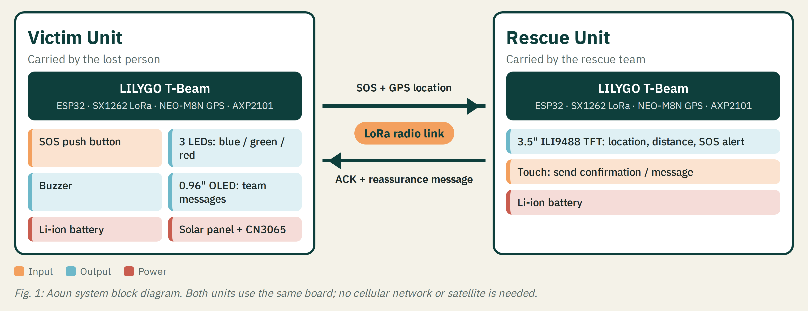
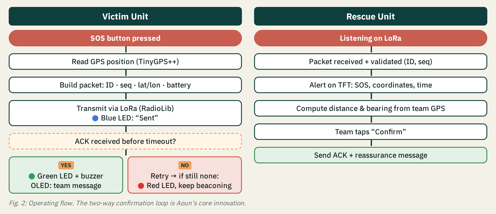
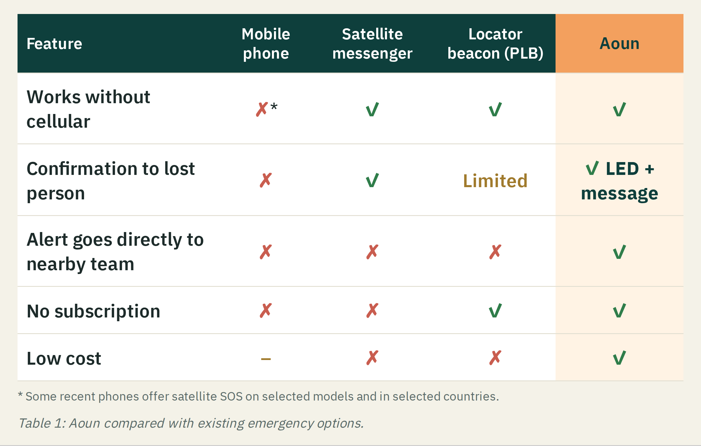

# Aoun (عون): Two-Way LoRa Distress & Tracking System

**Security & Innovation Fair (SAIF) 2026** · Smart Cities & Internet of Things (IoT) · Integrated hardware + software solution · Stage: **Proof of Concept**

> A low-cost, two-way LoRa distress and tracking system that connects lost persons to rescue teams beyond cellular coverage.

📄 **[Scientific Poster (PDF)](Aoun_SAIF_Poster.pdf)** · 🔒 **[Security Verification Report (PDF)](Aoun_Security_Verification_Report.pdf)**

[English](#english) · [العربية](#arabic)

---

## Overview

Aoun is a pair of devices that communicate directly over long-range LoRa radio, with **no cellular network, internet, subscription or satellite**.

- **Victim unit:** one press of the SOS button sends the lost person's GPS location.
- **Rescue unit:** shows the location on a screen, and the team sends back a confirmation.

When the confirmation arrives, the victim unit turns its **green LED** on and shows a reassurance message, so the lost person knows help is coming.

## The problem

People lost in deserts, mountains and remote areas are often far from any cellular coverage, so rescue teams must search wide areas without an exact location. Existing options leave a gap: phones need coverage, satellite messengers need subscriptions, and beacons alert a distant centre while giving the sender little or no confirmation. A lost person who does not know help is coming may panic and move away from the search area.

## Our solution

| Victim-unit LED | Meaning |
|---|---|
| 🔵 Blue | SOS sent |
| 🟢 Green | Rescue team confirmed receipt |
| 🔴 Red | No response after retries, keeps beaconing |

## Security by design

| Threat | Protection |
|---|---|
| Eavesdropping on the location | AES-128-GCM encryption |
| Fake SOS or fake "help is coming" message | Authentication tag: forged or modified packets are rejected |
| Replaying an old packet | Sequence numbers |
| Unknown transmitters | Registered-device whitelist |

## Results

| Metric | Result |
|---|---|
| Security test cases passed | **10 / 10** |
| Attack types rejected (forged, modified, replayed, wrong key, unknown device) | **5 / 5** |
| Encrypted SOS packet | **37 bytes** |
| Encrypted ACK + reassurance message | **62 bytes** |
| SOS airtime, SF9 / SF12 | **≈ 0.34 s / 2.5 s** |

Security tests were run on a PC host with the same code used in the firmware (details in the [report](Aoun_Security_Verification_Report.pdf)). Field validation of range, delivery rate, confirmation time and battery life follows hardware assembly.

## Innovation

**Two-way reassurance, not just an alarm.** Aoun tells the lost person, instantly and visibly, that the nearby team received the call. It needs no network, no subscription and no satellite.

## Status

**Proof of Concept.** The design, protocol and security layer are complete and verified. Hardware assembly and field testing are in progress.

**Future work:** mesh relaying, a rugged waterproof enclosure, automatic fall / no-motion SOS, a multi-team dashboard, and a pilot with a rescue team.

## Team

**Digital Technical College for Girls, Riyadh, Saudi Arabia**

| Name | Role |
|---|---|
| **Dana Mohammed Alanazi** | Team Leader |
| Renad Metab Aldosari | Team Member |
| Jawaher Faisal Alsharif | Team Member |
| Hailah Abdulrahman Alhejjei | Team Member |
| Abrar Hassan Alqarni | Team Member |

The source code is kept private and is available to the judging committee on request.

---

## نظرة عامة

عون جهازان يتواصلان مباشرة عبر موجات LoRa بعيدة المدى، **بدون شبكة جوال أو إنترنت أو اشتراك أو أقمار صناعية**.

- **جهاز المفقود:** بضغطة زر SOS يرسل موقعه من الـGPS.
- **جهاز الفريق:** يعرض الموقع على الشاشة، ويرسل منه الفريق تأكيداً.

عند وصول التأكيد تضيء **اللمبة الخضراء** وتظهر رسالة طمأنة، فيعرف المفقود أن المساعدة في الطريق.

## المشكلة

التائهون في الصحارى والجبال والمناطق النائية غالباً بعيدون عن تغطية الجوال، فتبحث الفرق في مساحات واسعة بدون موقع دقيق. الحلول الحالية فيها فجوة: الجوال يحتاج تغطية، وأجهزة الأقمار الصناعية تحتاج اشتراكاً، وأجهزة تحديد الموقع ترسل التنبيه لمركز بعيد ولا تعطي المرسل تأكيداً أو تعطيه تأكيداً محدوداً. والمفقود الذي لا يعرف إن كان أحد سمع نداءه قد يهلع ويبتعد عن منطقة البحث.

## الحل

| لمبة جهاز المفقود | المعنى |
|---|---|
| 🔵 أزرق | أُرسلت الاستغاثة |
| 🟢 أخضر | الفريق أكّد الاستلام |
| 🔴 أحمر | لا استجابة بعد إعادة المحاولة، ويستمر الجهاز في الإرسال |

## الأمان

| التهديد | الحماية |
|---|---|
| التنصت على الموقع | تشفير AES-128-GCM |
| استغاثة أو تأكيد مزيف | وسم توثيق يرفض أي رسالة مزورة أو معدّلة |
| إعادة إرسال رسالة قديمة | أرقام تسلسلية |
| أجهزة غير معروفة | قائمة أجهزة معتمدة |

## النتائج

| المقياس | النتيجة |
|---|---|
| اختبارات الأمان الناجحة | **10 من 10** |
| أنواع الهجمات المرفوضة | **5 من 5** |
| حجم رسالة الاستغاثة المشفرة | **37 بايت** |
| حجم رسالة التأكيد مع رسالة الطمأنة | **62 بايت** |
| زمن إرسال الاستغاثة (SF9 / SF12) | **≈ 0.34 ثانية / 2.5 ثانية** |

## الابتكار

**طمأنة ثنائية الاتجاه، وليست مجرد إنذار.** عون يُعلم المفقود فوراً وبشكل مرئي أن الفريق القريب استلم نداءه، بدون شبكة أو اشتراك أو أقمار صناعية.

## حالة المشروع

**إثبات مفهوم:** التصميم والبروتوكول وطبقة الأمان مكتملة ومختبرة، وتركيب الأجهزة والاختبار الميداني قيد التنفيذ.

## الفريق

**الكلية التقنية الرقمية للبنات، الرياض**

| الاسم | الدور |
|---|---|
|  (Dana Mohammed Alanazi) | قائدة الفريق |
| Renad Metab Aldosari | عضو الفريق |
|  (Jawaher Faisal Alsharif) | عضو الفريق |
| Hailah Abdulrahman Alhejjei | عضو الفريق |
| Abrar Hassan Alqarni | عضو الفريق |

الكود المصدري محفوظ بشكل خاص، ومتاح للجنة التحكيم عند الطلب.

---

## References | المراجع

1. Semtech, *SX1262 LoRa Connect Transceiver*: [semtech.com/products/wireless-rf/lora-connect/sx1262](https://www.semtech.com/products/wireless-rf/lora-connect/sx1262)
2. NIST SP 800-38D, *Recommendation for Block Cipher Modes of Operation: Galois/Counter Mode (GCM) and GMAC*: [csrc.nist.gov/pubs/sp/800/38/d/final](https://csrc.nist.gov/pubs/sp/800/38/d/final)
3. LILYGO, *LoRa Series (T-Beam)*: [github.com/Xinyuan-LilyGO/LilyGo-LoRa-Series](https://github.com/Xinyuan-LilyGO/LilyGo-LoRa-Series)
4. RadioLib: [github.com/jgromes/RadioLib](https://github.com/jgromes/RadioLib)
5. TinyGPS++: [github.com/mikalhart/TinyGPSPlus](https://github.com/mikalhart/TinyGPSPlus)
6. TFT_eSPI: [github.com/Bodmer/TFT_eSPI](https://github.com/Bodmer/TFT_eSPI)
7. Adafruit SSD1306: [github.com/adafruit/Adafruit_SSD1306](https://github.com/adafruit/Adafruit_SSD1306)
8. Mbed TLS: [github.com/Mbed-TLS/mbedtls](https://github.com/Mbed-TLS/mbedtls)

© 2026 Team Aoun, Digital Technical College for Girls. All rights reserved.
